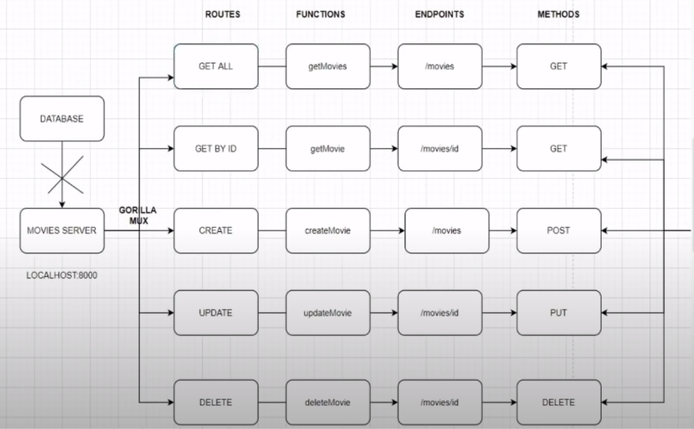

# Eleven Go Projects

[freeCodeCamp YouTube Course](https://www.youtube.com/watch?v=jFfo23yIWac)
[Akhil Sharma's Channel](https://www.youtube.com/c/AkhilSharmaTech/videos)

## 1. Simple Web Server

*Start - 00:20:00*

Reference [GitHub repo](https://github.com/AkhilSharma90/simple-http-server-GO)

Very basic HTTP server to serve static web content.

- Routes
  - / -> index.html
  - /hello -> calls hello function
  - /form.html -> form.html -> calls form function on submission

## 2. CRUD API

*00:20:00 - 1:07:00*

Reference [GitHub repo](https://github.com/AkhilSharma90/Golang-MySQL-CRUD-Bookstore-Management-API)

Basic CRUD API using [gorilla/mux](https://github.com/gorilla/mux). No database connection

Routes overview:

Install a package `go get "path/to/package"`