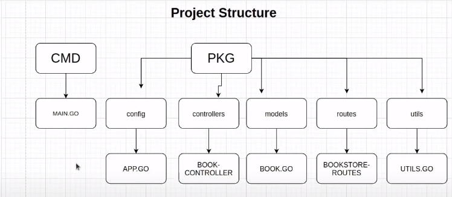

# Eleven Go Projects

- [freeCodeCamp YouTube Course](https://www.youtube.com/watch?v=jFfo23yIWac)
- [Akhil Sharma's Channel](https://www.youtube.com/c/AkhilSharmaTech/videos)

## 1. Simple Web Server

_Start - 00:20:00_

Reference [GitHub repo](https://github.com/AkhilSharma90/simple-http-server-GO)

Very basic HTTP server to serve static web content.

- Routes
  - / -> index.html
  - /hello -> calls hello function
  - /form.html -> form.html -> calls form function on submission

## 2. CRUD API

_00:20:00 - 1:07:00_

Reference [GitHub repo](https://github.com/AkhilSharma90/Golang-MySQL-CRUD-Bookstore-Management-API)

Basic CRUD API using [gorilla/mux](https://github.com/gorilla/mux). No database connection

Routes overview:

Install a package `go get "path/to/package"`

## 3. Bookstore App

Reference [GitHub repo](https://github.com/AkhilSharma90/Golang-MySQL-CRUD-Bookstore-Management-API)

MySQL CRUD API using [gorilla/mux](https://github.com/gorilla/mux), and [GORM](https://github.com/jinzhu/gorm)

Project overview:

Routes overview:

Create go.mod (like package.json) using `go mod init <package-name>`

Spin up a MySQL container for dev

    docker run --name go-mysql \
        -e MYSQL_ROOT_PASSWORD=password \
        -e MYSQL_DATABASE=simplerest \
        -e MYSQL_USER=hamish \
        -e MYSQL_PASSWORD=password \
        -p 3306:3306 -d mysql:latest
